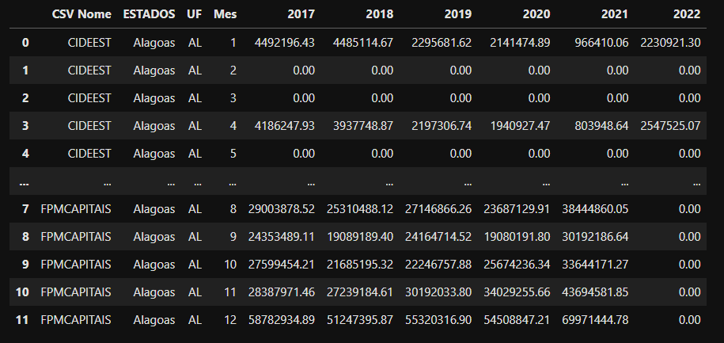

# Desafio para o processo seletivo

## Desafio:

Seu desafio será obter informações sobre o valor das transferências transferências obrigatórias da União para os estados entre os anos de 2017 e 2022 APENAS para o estado de Alagoas. 

Este é um desafio <b>NÃO ELIMINATÓRIO</b>. Isto quer dizer que vamos utilizar este teste apenas para entender melhor o seu perfil, sua lógica de programação e assim, poderemos traçar o melhor plano de treinamento caso você seja selecionado(a).

## Onde encontrar informações sobre servidores ativos: 

O Tesouro Nacional disponibiliza vários conjuntos de dados na seção de dados abertos. Vamos coletar TODOS os csv disponibilizados na seguinte página: https://www.tesourotransparente.gov.br/ckan/dataset/transferencias-obrigatorias-da-uniao.

## Instruções:

O seu processo de ETL poderá ser dividido nas seguintes etapas:
 <li>
 Extração de dados:
 <ol>
 Extraia TODOS os CSV da url fornecida acima 
 Fique a vontade para extrair os dados usando a ferramenta na qual você se sente confortável (scrapy, bs4 etc) 
 </ol>
 <li>
 Transformação dos dados:
 <ol>
 Queremos APENAS dados de 2017 a 2022 
 Apenas dados do Estado de Alagoas 
 Os meses devem ser do tipo Inteiros 
 Os valores monetários devem ser do tipo Float 
 Unir todas as tabelas em uma única tabela. 
 </ol>
 </li>
 
O resultado final deve ser um dataframe com as seguintes informações e na seguinte ordem das colunas: 
 

 
## Atenção:

<ul>
    <li>Nós trabalhamos com Python 3.</li>
    <li>Sugerimos o uso de repositórios públicos (como GitHub ou GitLab) e o envio da URL do repositório com o código criado em Python, mas você também podem zipar o código e enviar por email; se você optar por outras ferramentas (Google Colab, Gitpod, PythonAnywhere), é necessário que o código da solução seja compartilhada através de um link público.</li>
    <li>Não responder o teste completamente não te desclassifica do processo seletivo. Mas, tente obter o máximo possível de informações. </li>
    
</ul>

NÃO EXISTE resposta certa

